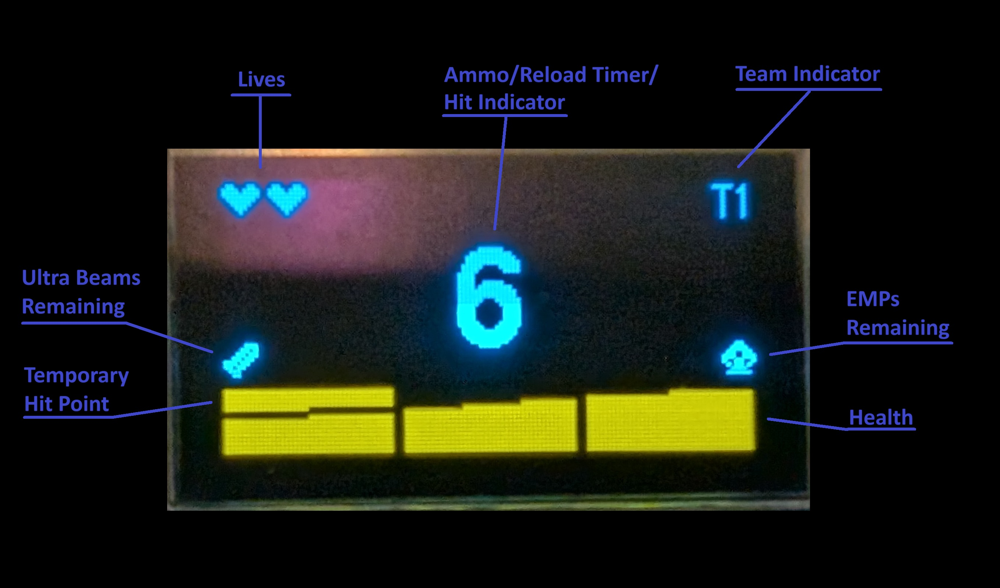
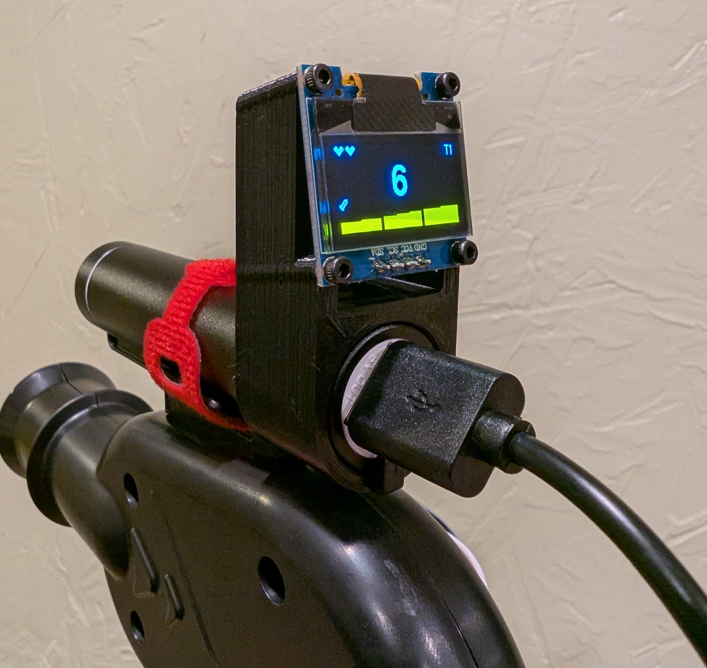

# Wireless Comms, OLED Screen, and Ultra Beam Game for Laser Tag

## Description

This hack for the [Crunchlabs Hack Pack Box 5 - Laser Tag](https://www.crunchlabs.com/products/laser) adds an OLED screen that displays information for custom game modes, plus wireless communication between blasters using the nRF24L01+. The wireless comms enable new game mechanics such as an EMP blast and hit confirmation.

  
  

## Game Mechanics

* **Lives** - Each player starts with **2 lives**
* **Game Over** - Players reduced to 0 lives are out of the game with a **Game Over** screen
* **3 Health per life** – The goggles dim by 1/3 per health lost
* **6 Max Ammo** – Reload 1 ammo per second while holding the reload button
* **Ultra Beam:**
  * Charge the **Ultra Beam** by holding reload for 5 seconds when your ammo is maxed out
  * Fire a devastating shot that reduces your target's health to 0, but at a cost:
    * Lose 1 health
    * Consume all your ammo
    * Only 1 Ultra Beam per game
  * Make it count!
* **Team Selection** - When the game starts, you must select a team
  * Press reload to change teams
  * Hold the trigger for 2 seconds to start the game for everyone
  * Player icons are displayed indicating the number of players on each team
* **Successful Hit Indicator** - If a shot hits an enemy, the hit indicator will briefly display on your screen
  * The indicator changes slightly when your hit is a regular shot, Ultra Beam, or an elimination
* **Victory Screen** - If all opposing teams are eliminated, a victory screen will display
* **EMP Blast:**
  * An **EMP blast** is awarded when you are hit by an opponent's **Ultra Beam**
  * Hold the reload button and the trigger for 1 second to detonate an EMP blast
    * Grants you and nearby teammates with 1 temporary hitpoint for 20 seconds
      * The temporary hitpoint also protects you from Ultra Beam overload damage
    * Disables nearby enemies for 4 seconds
      * Disabled enemies can still be hit!
  * Coordinate for a devastating counter attack!

## OLED Screen Features

Displays critical game info, including:
* Ammo count
* Team number
* Lives
* Which team hit you
* Whether you were hit by an **Ultra Beam**

## Hardware

* [Crunchlabs Hack Pack Box 5 - Laser Tag](https://www.crunchlabs.com/products/laser)
* 2 [0.96 Inch OLED I2C Display Module](https://amzn.com/dp/B09C5K91H7)
* 2 [nRF24L01+ 2.4GHz Wireless RF Transceivers](https://amzn.com/dp/B07GZ17ZWS)
* 2 [Push Buttons](https://amzn.com/dp/B07ZV3PB26) for reload - Something with more of a click would be better
* 2 [3v Mini Vibration Motors](https://amzn.com/dp/B0B4SK8M1C)
* [Dupont Wires](https://amzn.com/dp/B07GD2BWPY)
* A 3D printer or access to one to print the screen mount (alternatively, the screen can be held on by strapping the wires down with the velcro battery strap)
* A Hot glue gun - The vibration motor adhesive did not hold
* A soldering iron
* 8 M2 screws - 4mm or longer
* Needle nose pliers - to remove plastic to make room for the nRF24L01+

## Wiring

### OLED:
* SDA -> A4
* SCL -> A5
* VCC -> 5v Rail
* GND -> GND Rail

### nRF24L01+:
* VCC -> 3v3 (NOT 5v!)
* GND -> GND Rail
* CE -> D2
* CSN -> D4
* MOSI -> D11
* MISO -> D12
* SCK -> D13

### Reload Button:
* Positive Terminal -> A0
* Negative Terminal -> GND Rail

### Vibration Motor:
* Positive Wire -> A2
* Negative Wire -> GND Rail